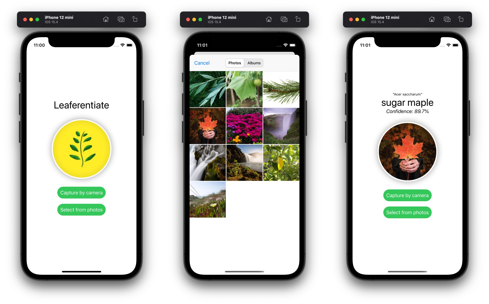

# Leaferentiate

An iOS leaf identification app build with SwiftUI. Credits to [Plant.id](https://plant.id) for the plant identification model.

Views

- ContentView: main display
- PhotoLibraryView: presents a sheet on top of main display for selecting from the iOS photos library
- CameraView: replaces the main display with the camera view for capturing from camera

Coordinator

- Handles selected images, communicates with Plant.id API, and updates main display with identification results

## TODO

- [ ] Add animation to update identification result.
- [ ] Add Unit tests.
- [ ] Add UI tests.
- [x] Connect to Plant.id plant identification API.
- [x] Optimize result information display
- [x] Concurrent API calls
- [x] Show ProgressView when waiting for results to come back

## About

This was originally a course project of SUSTech CS303 Artificial Intelligence. Identification results were fetched from a model trained and deployed on [ModelArts](https://www.huaweicloud.com/intl/en-us/product/modelarts.html).

Credits to Chang Cao for ModelArts support, Tianye Shu for leaf datasets, and Sicong Yao for the name "Leafferentiate".

### April 2020 Update

My interviewer asked about the difference between Leaferentiate and major plant identification apps out there in the market. My answer wasn't quite satisfying, but I actually thought about this when I was deciding what features to implement on this app. Despite possibly more fancy UI/UX, faster query time, bigger dataset, and better accuracy, a nice feature that I gave up was plant description in the result. This requires pre-attached descriptive text to plant names or real-time web searching.

Current apps in App Store even provide corresponding Classical Chinese poetry entries for the plant as well as scenery recommendation based on user's current location. More ambitious apps would try to equip themselves with social functionalities and create communities for their users where they can post their thoughts and chat with friends.
